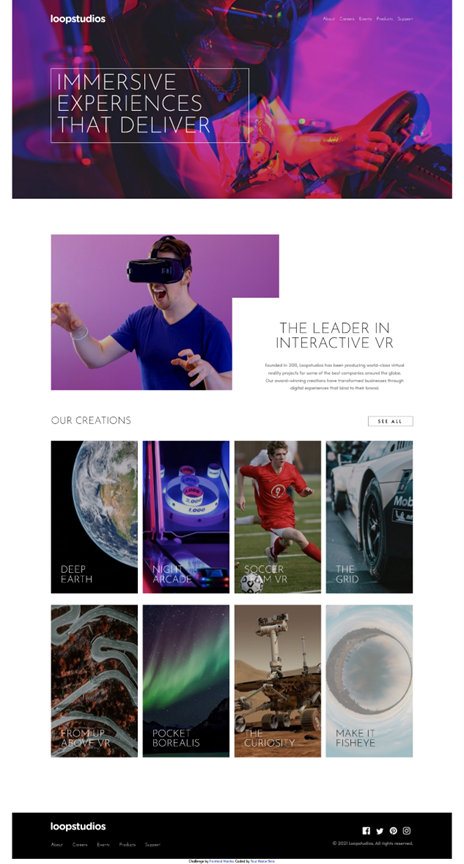
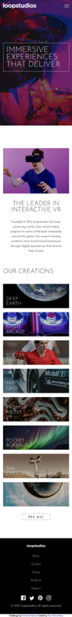

# Frontend Mentor - Loopstudios landing page solution

This is a solution to the [Loopstudios landing page challenge on Frontend Mentor](https://www.frontendmentor.io/challenges/loopstudios-landing-page-N88J5Onjw). Frontend Mentor challenges help you improve your coding skills by building realistic projects. 

## Table of contents

- [Overview](#overview)
  - [The challenge](#the-challenge)
  - [Screenshot](#screenshot)
  - [Links](#links)
- [My process](#my-process)
  - [Built with](#built-with)
  - [What I learned](#what-i-learned)
  - [Continued development](#continued-development)
  - [Useful resources](#useful-resources)
- [Author](#author)
- [Acknowledgments](#acknowledgments)

## Overview

### The challenge

Users should be able to:

- View the optimal layout for the site depending on their device's screen size
- See hover states for all interactive elements on the page

### Screenshot

### Links

- Solution URL: [https://github.com/toshirokubota/loopstudios-landing-page](https://github.com/toshirokubota/loopstudios-landing-page)
- Live Site URL: [https://toshirokubota.github.io/loopstudios-landing-page/](https://toshirokubota.github.io/loopstudios-landing-page/)

## My process

### Built with

- Semantic HTML5 markup
- CSS custom properties
- Flexbox
- CSS Grid
- Mobile-first workflow
- SCSS

### What I learned

In this project, I used SCSS/SASS for the first time!

### Continued development

I am in the "advanced CSS techniques" learning path. I will continue working on the path.

### Useful resources

- [Sass cheatsheet](https://devhints.io/sass) - I found this cheatsheet useful for a quick reference on SASS's main features.

## Author
- Frontend Mentor - [@toshirokubota](https://www.frontendmentor.io/profile/yourusername)

## Acknowledgments

